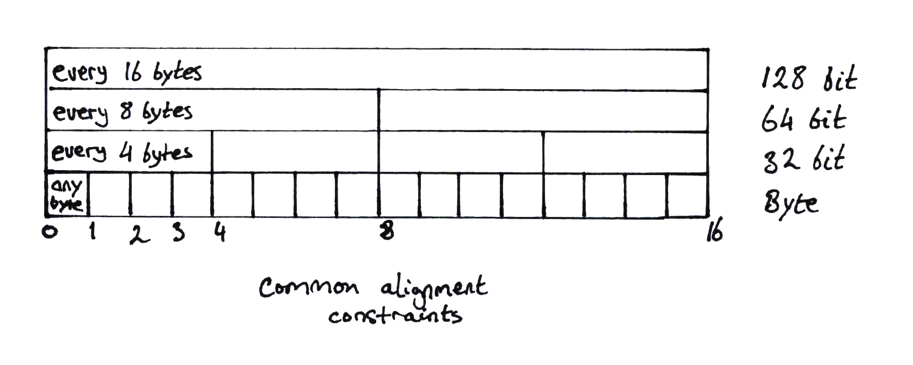

# Alignment

There are subtleties in memory access alignment:

- Some hardware architectures and implementations may fault on unaligned
  memory access.
- Atomic operations require word-aligned access.
- SIMD operations typically require double-word-aligned access.
- In practice on 64 bit architectures, allocators align objects to 8 byte
  boundaries for 64 bit objects and smaller and 16 byte boundaries for larger
  objects for performance optimization and the above reasons.

Intel 32 and 64 bit x86 architectures allow general access to be unaligned but
will probably incur an access penalty. The story on 32bit ARM and aarch64 is
sufficiently similar but there is a higher chance that an ARM core is
configured to raise a bus error on a misaligned access.

Another very important factor is atomic memory operations.
Atomic access works on a whole word basis - any unaligned access by nature
cannot be guaranteed to be atomic as it will probably involve more than one
access.  To support atomic operations, alignment must be minmally on word
boundaries.

SIMD operations, tending to be 128 bits wide or higher, should be
aligned to 16 byte boundaries for optimal code generation and performance.
Unaligned loads and stores may be allowed but normally these incur
performance penalties.



While Intel allows unaligned access (that is, alignment on any byte boundary),
the
[recommended](https://software.intel.com/sites/default/files/managed/9e/bc/64-ia-32-architectures-optimization-manual.pdf?wapkw=248966)
(see section 3.6.4) alignment for objects larger than 64 bits is to 16 byte
boundaries.

Apparently system `malloc()` implementations
[tend to comply](http://www.erahm.org/2016/03/24/minimum-alignment-of-allocation-across-platforms/)
with the 16 byte boundary.

To verify the above, a rough test of both the system allocator and jemalloc
on x86_64 by using `Box::new()` on a set of types (`u8`, `u16`, `u32`, `u64`,
`String` and a larger `struct`) confirms a minimum of 8 byte alignment for
anything word size or smaller and 16 byte alignment for everything bigger.
Sample pointer printouts below are for jemalloc but Linux libc malloc produced
the same pattern:

```
p=0x7fb78b421028 u8
p=0x7fb78b421030 u16
p=0x7fb78b421038 u32
p=0x7fb78b421050 u64
p=0x7fb78b420060 "spam"
p=0x7fb78b4220f0 Hoge { y: 2, z: "ほげ", x: 1 }
```

Compare with `std::mem::align_of<T>()` which, on x86_64 for example,
returns alignment values:

- `u8`: 1 byte
- `u16`: 2 bytes
- `u32`: 4 bytes
- `u64`: 8 bytes
- any bigger struct: 8

Thus despite the value of `std::mem::align_of::<T>()`, mature allocators will
do what is most pragmatic and follow recommended practice in support of optimal
performance.

With all that in mind, to keep things simple, we'll align everything to a
double-word boundaries. When we add in prepending an object header, the minimum
memory required for an object will be two words anyway.

Thus, the allocated size of an object will be calculated[^1] by

```rust,ignore
let alignment = size_of::<usize>() * 2;
// mask out the least significant bits that correspond to the alignment - 1
// then add the full alignment
let size = (size_of::<T>() & !(alignment - 1)) + alignment;
```

----

[^1]: For a more detailed explanation of alignment adjustment calculations, see
[phil-opp](https://github.com/phil-opp)'s kernel
[heap allocator](https://os.phil-opp.com/kernel-heap/#alignment).
