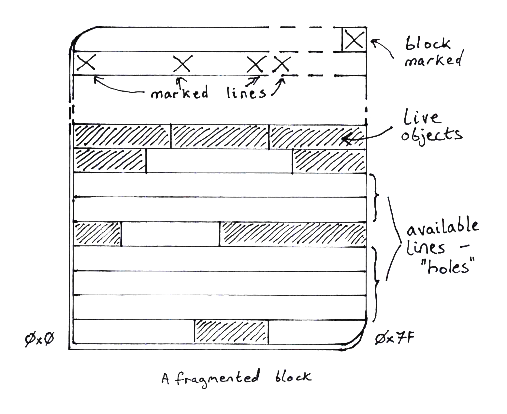

# Bump allocation

Now that we can get blocks of raw memory, we need to write objects into it. The
simplest way to do this is to write objects into a block one after the other
in consecutive order. This is bump allocation - we have a pointer, the bump
pointer, which points at the space in the block after the last object that
was written. When the next object is written, the bump pointer is incremented
to point to the space after _that_ object.

In a twist of mathematical convenience, though, it is [more efficient][2] to
bump allocate from a high memory location _downwards_. We will do that.

We will used a fixed power-of-two block size. The benefit of this is that
given a pointer to an object, by zeroing the bits of the pointer that represent
the block size, the result points to the beginning of the block. This will
be useful later when implementing garbage collection.

Our block size will be 32k, a reasonably optimal size arrived at in the
original [Immix paper][1]. This size can be any power of two though and
different use cases may show different optimal sizes.

```rust,ignore
{{#include ../stickyimmix/src/constants.rs:ConstBlockSize}}
```

Now we'll define a struct that wraps the block with a bump pointer and garbage
collection metadata:

```rust,ignore
{{#include ../stickyimmix/src/bumpblock.rs:DefBumpBlock}}
```

## Bump allocation basics

In this struct definition, there are two members that we are interested in
to begin with. The other two, `limit` and `meta`, will be discussed in the
next section.

* `cursor`: this is the bump pointer. In our implementation it is the index
  into the block where the last object was written.
* `block`: this is the `Block` itself in which objects will be written.

Below is a start to a bump allocation function:

```rust,ignore
impl BumpBlock {
    pub fn inner_alloc(&mut self, alloc_size: usize) -> Option<*const u8> {
        let block_start_ptr = self.block.as_ptr() as usize;
        let cursor_ptr = self.cursor as usize;

        // align to word boundary
        let align_mask = usize = !(size_of::<usize>() - 1);

        let next_ptr = cursor_ptr.checked_sub(alloc_size)? & align_mask;

        if next_ptr < block_start_ptr {
            // allocation would start lower than block beginning, which means
            // there isn't space in the block for this allocation
            None
        } else {
            self.cursor = next_ptr as *const u8;
            Some(next_ptr)
        }
    }
}
```

In our function, the `alloc_size` parameter should be a number of bytes of
memory requested.

The value of `alloc_size` may produce an unaligned pointer at which to write the
object. Fortunately, by bump allocating downward we can apply a simple mask to the
pointer to align it down to the nearest word:

```rust,ignore
        let align_mask = usize = !(size_of::<usize>() - 1);
```

In initial implementation, allocation will simply return `None` if the block
does not have enough capacity for the requested `alloc_size`. If there _is_
space, it will be returned as a `Some(*const u8)` pointer.

Note that this function does not _write_ the object to memory, it merely
returns a pointer to an available space.  Writing the object will require
invoking the `std::ptr::write` function. We will do that in a separate module
but for completeness of this chapter, this might look something like:

```rust,ignore
use std::ptr::write;

unsafe fn write<T>(dest: *const u8, object: T) {
    write(dest as *mut T, object);
}
```


## Some time passes...

After allocating and freeing objects, we will have gaps between objects in a
block that can be reused. The above bump allocation algorithm is unaware of
these gaps so we'll have to modify it before it can allocate into fragmented
blocks.

To recap, in Immix, a block is divided into lines and only whole lines are
considered for reuse. When objects are marked as live, so are the lines that an
object occupies. Therefore, only lines that are _not_ marked as live are usable
for allocation into. Even if a line is only partially allocated into, it is not
a candidate for further allocation.

In our implementation we will use the high bytes of the `Block` to represent
these line mark bits, where each line is represented by a single byte.

We'll need a data structure to represent this. we'll call it `BlockMeta`,
but first some constants that we need in order to know

- how big a line is
- how many lines are in a block
- how many bytes remain in the `Block` for allocating into

```rust,ignore
{{#include ../stickyimmix/src/constants.rs:ConstLineSize}}
```

For clarity, let's put some numbers to the definitions we've made so far:
- A block size is 32Kbytes
- A line is 128 bytes long
- The number of lines within a 32Kbyte `Block` is 256

Therefore the top 256 bytes of a `Block` are used for line mark bits. Since
these line mark bits do not need to be marked themselves, the last _two bytes_
of the `Block` are not needed to mark lines.

This leaves one last thing to mark: the entire `Block`. If _any_ line in the
`Block` is marked, then the `Block` is considered to be live and must be marked
as such.

We use the final byte of the `Block` to store the `Block` mark bit.

The definition of `BumpBlock` contains member `meta` which is of type
`BlockMeta`. We can now introduce the definition of `BlockMeta` which we simply
need to represent a pointer to the line mark section at the end of the `Block`:

```rust,ignore
{{#include ../stickyimmix/src/blockmeta.rs:DefBlockMeta}}
```

This pointer could be easily calculated, of course, so this is just a handy
shortcut.

### Allocating into a fragmented Block



The struct `BlockMeta` contains one function we will study:

```rust,ignore
{{#include ../stickyimmix/src/blockmeta.rs:DefFindNextHole}}
```

The purpose of this function is to locate a gap of unmarked lines of sufficient
size to allocate an object of size `alloc_size` into.

The input to this function, `starting_at`, is the offset into the block to start
looking for a hole.

If no suitable hole is found, the return value is `None`.

If there are unmarked lines lower in memory than the `starting_at` point (bump
allocating downwards), the return value will be a pair of numbers: `(cursor,
limit)` where:

- `cursor` will be the new bump pointer value
- `limit` will be the lower bound of the available hole.

#### A deeper dive

Our first variable is a counter of consecutive available lines. This count will
always assume that the first line in the sequence is conservatively marked and
won't count toward the total, unless it is line 0.

```rust,ignore
        let mut count = 0;
```

Next, the `starting_at` and `alloc_size` arguments have units of bytes but we
want to use line count math, so conversion must be done.

```rust,ignore
         let starting_line = starting_at / constants::LINE_SIZE;
         let lines_required = (alloc_size + constants::LINE_SIZE - 1) / constants::LINE_SIZE;
```

Our final variable will be the end line that, together with `starting_line`,
will mark the boundary of the hole we hope to find.

```rust,ignore
        let mut end = starting_line;
```

Now for the loop that identifies holes and ends the function if either:
- a large enough hole is found
- no suitable hole is found

We iterate over lines in decreasing order from `starting_line` down to line zero
and fetch the mark bit into variable `marked`.

```rust,ignore
        for index in (0..starting_line).rev() {
            let marked = unsafe { *self.lines.add(index) };
```

If the line is unmarked, we increment our consecutive-unmarked-lines counter.

Then we reach the first termination condition: we reached line zero and we have
a large enough hole for our object. The hole extents can be returned, converting
back to byte offsets.

```rust,ignore
            if marked == 0 {
                count += 1;

                if index == 0 && count >= lines_required {
                    let limit = index * constants::LINE_SIZE;
                    let cursor = end * constants::LINE_SIZE;
                    return Some((cursor, limit));
                }
            } else {
```

Otherwise if the line is marked, we've reached the end of the current hole (if
we were even over one.)

Here, we have the second possible termination condition: we have a large enough
hole for our object. The hole extents can be returned, taking the last line as
conservatively marked.

This is seen in adding 2 to `index`:
- 1 for walking back from the current marked line
- plus 1 for walking back from the previous conservatively marked line

If this condition isn't met, our search is reset - `count` is back to zero and
we keep iterating.

```rust,ignore
            } else {
                if count > lines_required {
                    let limit = (index + 2) * constants::LINE_SIZE;
                    let cursor = end * constants::LINE_SIZE;
                    return Some((cursor, limit));
                }

                count = 0;
                end = index;
            }
```

Finally, if iterating over lines reached line zero without finding a hole, we
return `None` to indicate failure.

```rust,ignore
        }

        None
    }
```

#### Making use of the hole finder

We'll return to the `BumpBlock::inner_alloc()` function now to make use of
`BlockMeta` and its hole finding operation.

The `BumpBlock` struct contains two more members: `limit` and `meta`. These
should now be obvious - `limit` is the known byte offset limit into which
we can allocate, and `meta` is the `BlockMeta` instance associated with the
block.

We need to update `inner_alloc()` with a new condition:

* the size being requested must fit between `self.cursor` and `self.limit`

(Note that for a fresh, new block, `self.limit` is set to the block size.)

If the above condition is not met, we will call
`BlockMeta::find_next_available_hole()` to get a new `cursor` and `limit`
to try, and repeat that until we've either _found_ a big enough hole or
reached the end of the block, exhausting our options.

The new definition of `BumpBlock::inner_alloc()` reads as follows:

```rust,ignore
{{#include ../stickyimmix/src/bumpblock.rs:DefBumpBlockAlloc}}
```

and as you can see, this implementation is recursive.


## Wrapping this up

At the beginning of this chapter we stated that given a pointer to an object, by
zeroing the bits of the pointer that represent the block size, the result points
to the beginning of the block.

We'll make use of that now.

During the mark phase of garbage collection, we will need to know which line or
lines to mark, in addition to marking the object itself. We will make a copy of
the `BlockMeta` instance pointer in the 0th word of the memory block so that
given any object pointer, we can obtain the `BlockMeta` instance.

In the next chapter we'll handle multiple `BumpBlock`s so that we can keep
allocating objects after one block is full.

[1]: http://www.cs.utexas.edu/users/speedway/DaCapo/papers/immix-pldi-2008.pdf
[2]: https://fitzgeraldnick.com/2019/11/01/always-bump-downwards.html
