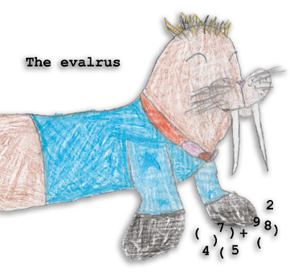

# The Eval-rs

In this part of the book we'll dive into creating:
* a safe Rust layer on top of the Sticky Immix API of the previous part
* a compiler for a primitive s-expression syntax language
* a bytecode based virtual machine

So what kind of interpreter will we implement? This book is a guide to help
you along your own journey and not not intended to provide an exhaustive
language ecosystem. The direction we'll take is to support John McCarthy's
classic s-expression based meta-circular evaluator[^1].

Along the way we'll need to implement fundamental data types and structures
from scratch upon our safe layer - symbols, pairs, arrays and dicts - with
each chapter building upon the previous ones.

While this will not result in an exhaustive language implementation,
you'll see that we _will_ end up with all the building blocks for you to take
it the rest of the way!

We shall name our interpreter "Eval-rs", for which we have an appropriate
illustration generously provided by the author's then 10 year old daughter.

We'll begin by defining the safe abstration over the Sticky Immix interface.
Then we'll put that to use in parsing s-expressions into a very simple data
structure.

Once we've covered those basics, we'll build arrays and dicts and then
use those in the compiler and virtual machine.

[^1]: These days this is cliché but that is substantially to our benefit. We're
not trying to create yet another Lisp, rather the fact that there is a
preexisting design of some elegance and historical interest is a convenience.
For a practical, accessible introduction to the topic, do see Paul
Graham's [The Roots of Lisp](http://www.paulgraham.com/rootsoflisp.html)
