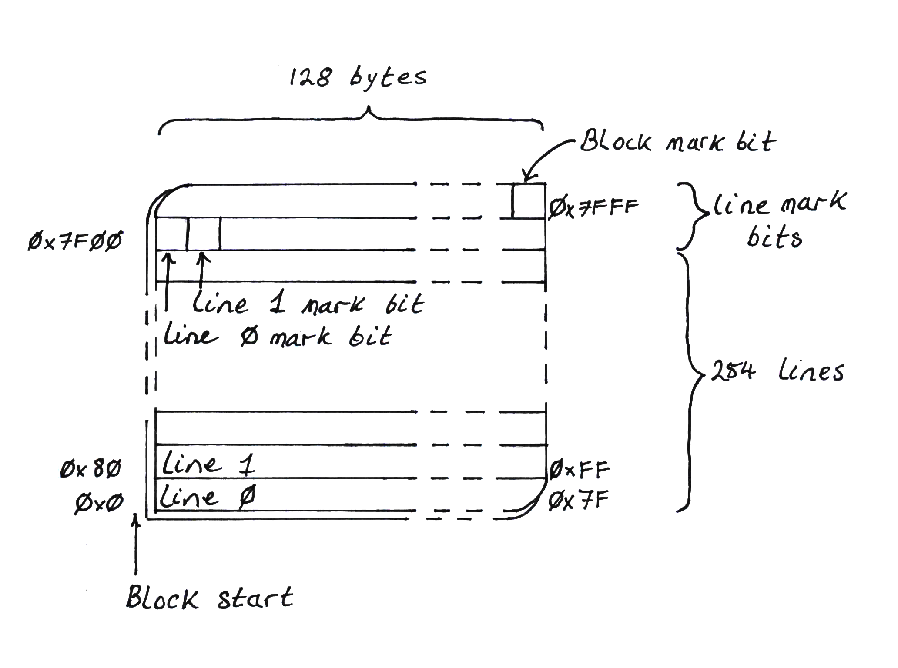

# An allocator: Sticky Immix

Quickly, some terminology:

* Mutator: the thread of execution that writes and modifies objects on the heap.
* Live objects: the graph of objects that the mutator can reach, either directly
  from it's stack or indirectly through other reachable objects.
* Dead objects: any object that is disconnected from the mutator's graph of live
  objects.
* Collector: the thread of execution that identifies objects that are no longer
  reachable by the mutator and marks them as free space that can be reused
* Fragmentation: as objects have many different sizes, after allocating and
  freeing many objects, gaps of unused memory appear between objects that are
  too small for most objects but that add up to a measurable percentage of
  wasted space.
* Evacuation: when the collector _moves_ live objects to another block of memory
  so that the originating block can be _de_fragmented_

## About Immix

Immix is a memory management scheme that considers blocks of fixed size at a time.
Each block is divided into lines. In the original paper, blocks are sized at 32k
and lines at 128 bytes.  Objects are allocated into blocks using bump allocation
and objects can cross line boundaries.

During tracing to discover live objects, objects are marked as live, but the
line, or lines, that each object occupies are also marked as live. This can mean, of
course, that a line may contain a dead object and a live object but the whole
line is marked as live.

To mark lines as live, a portion of the block is set aside for line mark bits,
usually one byte per mark bit. If _any_ line is marked as live, the whole block
is also marked as live. There must also, therefore, be a bit that indicates
block liveness.

### Conservative marking

The Immix authors found that marking _every_ line that contains a live object
could be expensive. For example, many small objects might cross line boundaries,
requiring two lines to be marked as live. This would require looking up the
object size and calculating whether the object crosses the boundary into the
next line. To save CPU cycles, they simplified the algorithm by saying that
any object that fits in a line _might_ cross into the next line so we will
conservatively _consider_ the next line marked just in case. This sped up
marking at little fragmentation expense.

### Collection

During collection, only lines not marked as live are considered available for
re-use. Inevitably then, there is acceptance of some amount of fragmentation
at this point.

_Full_ Immix implements evacuating objects out of the most fragmented blocks
into fresh, empty blocks, for defragmentation.

For simplicity of implementation, we'll leave out this evacuation operation
in this guide. This is called _Sticky_ Immix.

We'll also stick to a single thread for the mutator and collector to avoid the
complexity overhead of a multi-threaded implementation for now.

Recommended reading: [Stephen M. Blackburn & Kathryn S. McKinley - Immix: A Mark-Region Garbage Collector with Space Efficiency, Fast Collection, and Mutator Performance][1]

## About this part of the book

This section will describe a Rust crate that implements a Sticky Immix heap.
As part of this implementation we will dive into the crate API details to
understand how we can define an interface between the heap and the language
VM that will come later.

_What this is not: custom memory management to replace the global Rust
allocator! The APIs we arrive at will be substantially incompatible with the
global Rust allocator._

[1]: http://users.cecs.anu.edu.au/~steveb/pubs/papers/immix-pldi-2008.pdf
